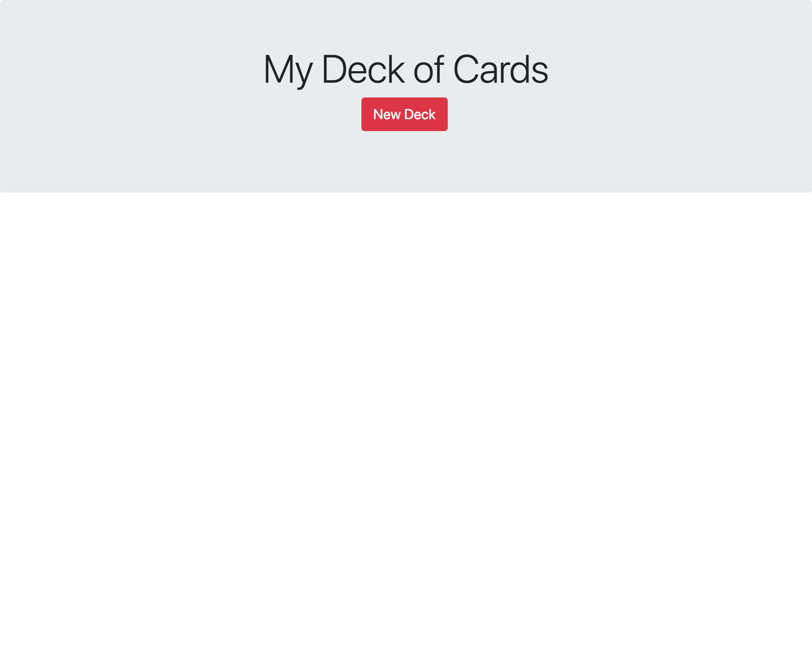
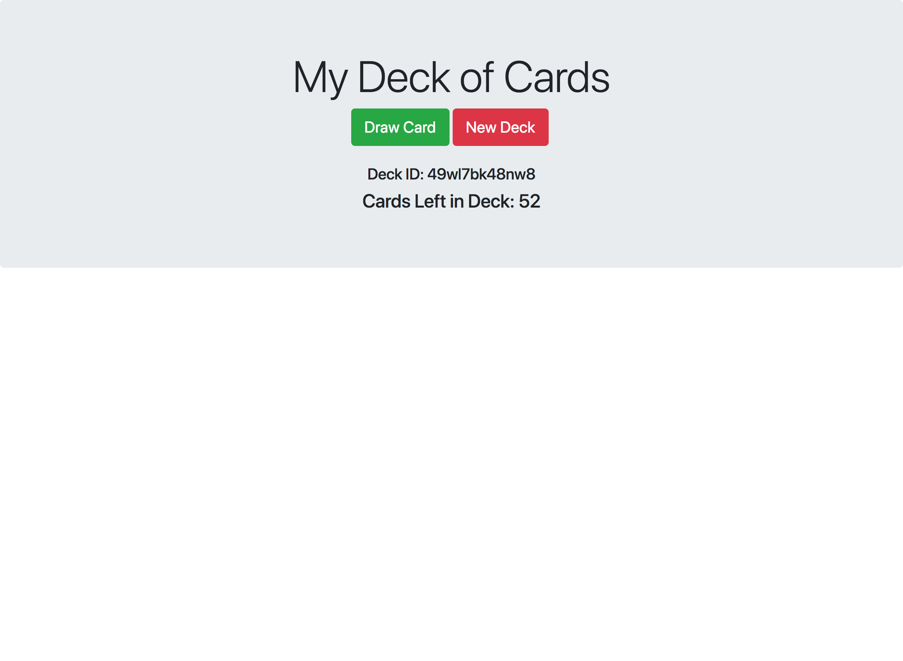
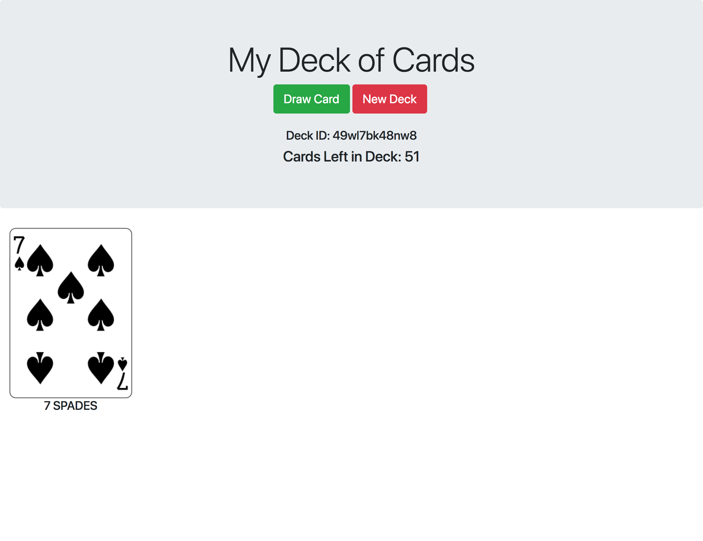
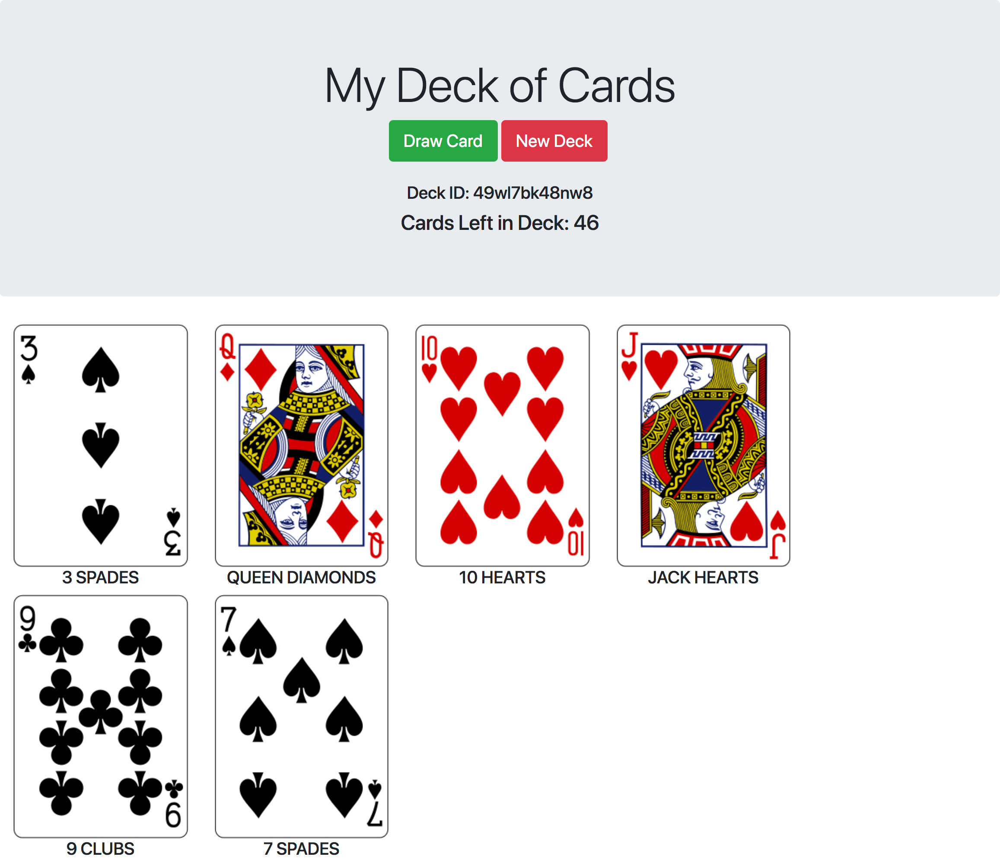

# Unit 2 Final

## Restrictions
- You may NOT have Slack open or any other form of communication software
- You may NOT use your phone during the exam
- You may NOT collaborate with any other students

## Task
- You will be building a single page application that mimics drawing from a deck of cards
- You will start off with an empty application that will prompt you to create a "New Deck"
- Once created, the application will reveal a special ID for the unique deck and how many cards are remaining in the deck. A "Draw Card" button will be revealed.
- Now everytime you press "Draw Card" it should draw a random card from the deck. Show it at the top of the list. Update how many cards are remaining in the deck.
- The cards should be shown in reverse chronological order in rows of 4 cards per row.
- Once the user has drawn all 52 cards from the deck, don't let the user draw any more cards. Stop them from sending the request and send an `alert()`
- By default the card `value` and `suit` is displayed below the card image. For any card rendering, clicking on the card should render card `value` and card `suit` on top of the image. For example, given the following card:

```javascript
{
    "image": "https://deckofcardsapi.com/static/img/KH.png",
    "value": "KING",
    "suit": "HEARTS",
    "code": "KH"
},
```

Clicking on this card would display: `"KING HEARTS"` above the card image.

- Clicking on the same card AGAIN would return the `"KING HEARTS"` text to the bottom of the image. You should be able to toggle this back and forth. This should be saved locally too so that even if you refresh the page, the states stay intact.


## Mockups

| Image | Description |
| --- | --- |
| <a href='assets/1.png'></a> | Initial State of the app. No deck drawn. No cards.
| <a href='assets/2.png'></a> | Deck Initiated. Shows ID, Remaining, and Draw Card button.
| <a href='assets/3.png'></a> | Clicking draw card: draws new card and displays below.
| <a href='assets/4.png'></a> | Displays all cards drawn in reverse chronological order.


## API

You will be using the `https://deckofcardsapi.com/` API.

The API will help you create a deck, manage and send you cards with all the data.

Example:

```javascript
{
    "success": true,
    "cards": [
        {
            "image": "https://deckofcardsapi.com/static/img/KH.png",
            "value": "KING",
            "suit": "HEARTS",
            "code": "KH"
        },
        {
            "image": "https://deckofcardsapi.com/static/img/8C.png",
            "value": "8",
            "suit": "CLUBS",
            "code": "8C"
        }
    ],
    "deck_id":"3p40paa87x90",
    "remaining": 50
}
```

Please read through their documentation and understand which endpoints you will be using for your app.

You don't need to build any randomizing function to distribute the cards. The API does all the logic for you. Your job is to primarily show the data and handle the events.

## Styling

- Grey header area with the title, buttons and deck information.
- Buttons musts be colored red `#DC3545` and green `#28A745`
- Buttons must have corner radius of `5px to 10px` and text color of white
- Cards must be in rows of 4 card per row. Do not give an absolute size to the cards.
- Cards must be in a row / col flexbox grid system.
- Try to recreate the app to resemble as closely to the mockup designs.

## Notes

- Make sure to only generate unique shuffled decks. So that the cards you draw are random. Look at the API to hit the right endpoint.
- Make sure once you generate a deck, you are using that specific deck to draw the cards from. *DON'T* create a new deck per card draw.
- You can use bootstrap if you want but not required ;]
- All of your state should be stored locally. So that if you refresh the page or close the browser and come back everything is still intact including your deck and cards.
